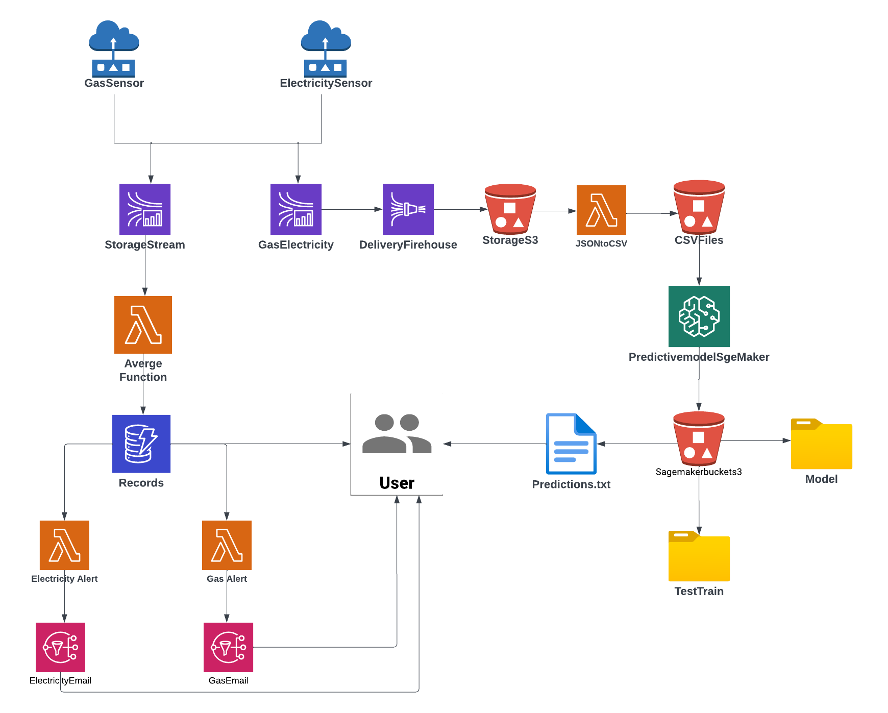

# Energy Efficiency Monitoring Station

## Overview

The Energy Efficiency Monitoring Station is a robust and versatile project that enables the collection and analysis of data related to gas and electricity usage. This repository serves as a comprehensive guide to set up and utilize the system for monitoring average gas and electricity consumption.

The project incorporates a simulated sensor system that generates data, sending it to Amazon Web Services (AWS) Simple Queue Service (SQS) queues. AWS Lambda functions process incoming data, compute average values, and store the results in AWS DynamoDB. It sends email notifications to users when the average values exceed specified thresholds. This system is designed for scalability and can be extended to handle real-time data from sensors

## Features

**Energy Usage Monitoring**: Simulated sensor data for gas and electricity usage.

**AWS Integration**: Utilizes AWS services, including SQS, Lambda, DynamoDB, and SNS for data queuing, processing, storage, and notifications.

**Data Processing**: AWS Lambda functions calculate average values for gas and electricity consumption.

**Threshold Alerts**: Email notifications are sent via AWS SNS when the average values exceed defined thresholds.

# Architecture

In this project:

- Mock sensor data for gas and electricity is generated using Python scripts in PyCharm.
- Data is sent to AWS Simple Queue Service (SQS) queues within your AWS account. Two queues are created, one for gas and another for electricity.
- AWS Lambda functions are set up to trigger when data arrives in these queues. These functions calculate average values for gas and electricity consumption.
- The processed data is saved in AWS DynamoDB for easy access and analysis.
- Thresholds are defined, and email notifications are sent via AWS Simple Notification Service (SNS) when the average values exceed these thresholds.
- Example of email when the Electricity usage threshold has been crossed:

- Example of email when the gas usage threshold has been crossed: 

- Additionally, code is provided in PyCharm that allows you to extract the entire DynamoDB table and display it on your console.

## Prerequisite

AWS Account 

PyCharm

Boto3

AWS CLI

## Setup

### Setup enviroment

To get started with the Energy Efficiency Monitoring Station, follow these steps:

1. **Clone the Repository**: Clone this repository to your local machine using the command `git clone https://github.com/yourusername/Energy-Efficiency-Monitoring.git`.

2. **AWS Setup**:
   - Set up your AWS account if you haven't already.
   - Create two AWS SQS queues, one for gas and one for electricity.
   - Configure AWS Lambda function-Energy consumption to trigger when data arrives in these queues.
   - Set up AWS DynamoDB to store the processed data.
   - Configure AWS Lambda function to trigger when data arrives in dynamodb.
   - Create an AWS SNS topic for email notifications.

3. **AWS Policies and roles**:
   - Create a new policy for reading into queues
   - Assign that policy to AWS Lambda-Energy consumption role
   - Assign full access to dynmodb policy and full access to SQS policy to AWS Lamda-Energy consumption role
   - Assign full access to dynmodb policy and full access to SNS policy to AWS Lamda-Alert_gas role
   - Assign full access to dynmodb policy and full access to SNS policy to AWS Lamda-Alert_electricity role

5. **Data Generation**:
   - Simulate data for gas and electricity usage. This can be achieved using Python scripts or any other preferred method.

6. **Data Ingestion**:
   - Send the simulated data to the respective SQS queues created in the previous step.

7. **Lambda Functions**:
   - Configure and deploy AWS Lambda functions to process incoming data from the queues.
   - The Lambda functions should perform average calculations for gas and electricity consumption.
   - Ensure that the results are saved to AWS DynamoDB for easy access and analysis.
   - From AWS Dynamodb, AWS Lamda-Alert_gas role and AWS Lamda-Alert_Electricity triggers if the values are above the thresholds 

6. **Threshold Configuration**:
   - Set the threshold values for gas and electricity consumption in the Lambda functions-Alert_gas and Alert_electricity respectively.
   - When the average values exceed these thresholds, the system will trigger an alert. This will send email to recipient.

## Usage

The Energy Efficiency Monitoring Station is a powerful tool for monitoring and improving energy efficiency. Here's how you can use it effectively:

- **Real Sensor Integration**: To monitor real-time data from physical sensors, adapt the project to handle incoming data streams.

- **Data Visualization**: Utilize the collected data to create visualizations and reports that provide insights into energy usage trends.

- **Alerting**: Implement alerting mechanisms based on threshold values to notify stakeholders of abnormal energy consumption patterns.

- **Analytics**: Utilize AWS or other analytics platforms to gain deeper insights from the stored data.

## Alerting

The project includes email notifications for alerting when the average values of gas and electricity usage exceed specified thresholds. Configure the email notifications in the AWS SNS topic and provide the appropriate email addresses for the recipients. It shows real time data to user. 

## Contributing

Contributions and improvements to this project are welcome. If you have ideas, bug fixes, or new features to add, please submit a pull request. Your input is valuable!

## License

This project is open-source and available under the [MIT License](LICENSE). Feel free to use, modify, and extend it according to your specific needs.

If you encounter any issues or have questions, please don't hesitate to open an issue in this repository.

Enjoy monitoring and improving energy efficiency with the Energy Efficiency Monitoring Station!

