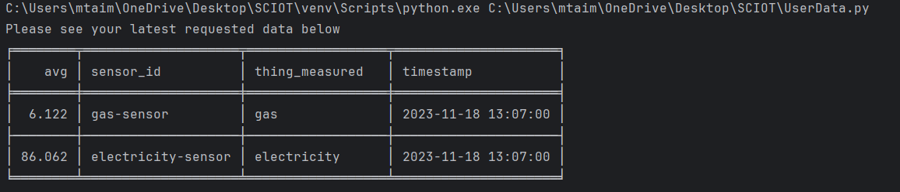
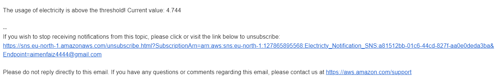
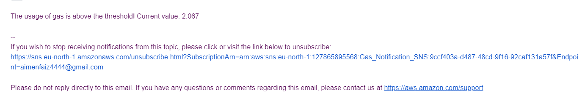

# Energy Efficiency Monitoring Station

## Overview

The Energy Efficiency Monitoring Station is a robust and versatile project that enables the collection and analysis of data related to gas and electricity usage. This repository serves as a comprehensive guide to set up and utilize the system for monitoring average gas and electricity consumption.

The project incorporates a simulated sensor system that generates data, sending it to Amazon Web Services (AWS) Kinesis streams. AWS Lambda functions process incoming data from one of the kinesis stream, compute average values, and store the results in AWS DynamoDB. It sends email notifications to users when the average values exceed specified thresholds. The other stream is used to make a predictive model for predicting future energy consumption. This system is designed for scalability and can be extended to handle real-time data from sensors.

## Features

**Energy Usage Monitoring:**

Simulated sensor data for gas and electricity usage in PyCharm.
Real-time transmission of data to AWS Kinesis streams for immediate processing.

**AWS Integration:**

Dual-stream integration with AWS Kinesis for parallel data analytics.
Utilizes AWS services, including Kinesis streams, Lambda, DynamoDB, S3 buckets, Sage maker, Kinesis firehouse and SNS for comprehensive data queuing, processing, storage, and notifications.

**Data Processing:**

1. Average computation: triggered upon data arrival in one Kinesis stream.
2. Lambda functions for gas and electricity connected to DynamoDB, triggered based on threshold values.
3. DynamoDB storage of distinct data entries, including sensor ID, average, timestamp, and measured parameters.
4. SNS services for Email notifiction
5. S3 buckets for saving data from sensors and converting data into CSV format for making the data set
6. Seprate lamda function for converting the data
7. Sage maker for making predictive model using XGBoost algorithm

**Threshold Alerts:**

Email notifications sent via AWS SNS when average gas or electricity values exceed predefined thresholds.
Additional Lambda functions for specific threshold alerting connected to DynamoDB.

**Data Ingestion for Predictive Modeling:**

One Kinesis stream specifically dedicated to predictive modeling for future energy consumption.
Data transfer from PyCharm to an S3 bucket via Kinesis Firehose, ensuring raw data preservation.

**Data Transformation and SageMaker Integration:**

Lambda function associated with the S3 bucket to convert raw data to CSV format.
Utilizes SageMaker for predictive analysis on future energy consumption.
Storage of SageMaker results in the S3 bucket, organized into two folders for test and train data, and a txt file containing prediction results.

**User Interaction:**

1. Local PyCharm access to DynamoDB data for real-time monitoring of average values.
2. Email notifications to users alerting them of threshold breaches.
3. Access to predictive values for future energy consumption.

# Architecture

# Project details
**Mocking Sensors and AWS Kinesis Streams**

1.  Sensor Mock:
Mock gas and electricity sensors in PyCharm to generate data.

2. AWS Kinesis Streams:
Set up two AWS Kinesis streams to receive data from PyCharm.
Streams are dedicated to gas and electricity values.

**Average Computation and DynamoDB**
1. Average Lambda Function:

Connect one Kinesis stream to an AWS Lambda function for average computation.
Lambda triggers upon data arrival and computes the average of 5 values.
Separate entries for gas and electricity are saved in DynamoDB.
DynamoDB entries include sensor ID, average, timestamp, and measured parameters.

2. Threshold Alert Lambda Functions:

Two additional Lambda functions connected to DynamoDB.
Triggered if gas or electricity averages cross predefined thresholds.
Send email notifications via AWS SNS to alert the user.

**Predictive Modeling with SageMaker**

1. Predictive Modeling Stream:
Use the second Kinesis stream for predictive modeling.
Data transferred to an S3 bucket via Kinesis Firehose in raw format.

2. CSV Conversion Lambda Function:
Lambda function associated with the S3 bucket converts raw data to CSV format.
Saves the converted data into another S3 bucket.

3. SageMaker Predictive Analysis:
Utilize SageMaker for predictive analysis on future energy consumption.
SageMaker saves data in the S3 bucket, creating folders for test and train data, and a txt file containing prediction results.

# User Interaction

**Local PyCharm Access:**

Users can access DynamoDB data to view average values locally in PyCharm.
Code is provided in PyCharm that allows you to extract the entire DynamoDB table and display it on your console.

**Email Notifications:**

Users receive email notifications when gas or electricity thresholds are crossed.
Example of email when the Electricity usage threshold has been crossed:

Example of email when the gas usage threshold has been crossed: 

**Accessing Predictive Values:**

Users can access predictive values stored in S3 buckets for future energy consumption by downloading the .txt file.

## Prerequisite

AWS Account 

PyCharm

Boto3

AWS CLI

## Setup

### Setup enviroment

To get started with the Energy Efficiency Monitoring Station, follow these steps:

1. **Clone the Repository**: Clone this repository to your local machine using the command `git clone https://github.com/yourusername/Energy-Efficiency-Monitoring.git`.

2. **AWS Setup**:
   - Set up your AWS account if you haven't already.
   - Create two AWS Kinesis streams and 1 kinesis firehouse stream for data delivery, one stream for Storage and one for real time energy consumption display.
   - Configure AWS Lambda function-AverageFunction to trigger when data arrives in storage stream.
   - Set up AWS DynamoDB to store the processed data.
   - Configure AWS Lambda functions to trigger when data arrives in dynamodb.
   - Lambdas should check averge values for Gas and electricity 
   - Create an AWS SNS topic for email notifications if the average values/threshold has been crossed.
   - Create Kinesis fire house for storage of data into bucket.
   - Configure a Lamda to convert JSON data to CSV to make it a data set files.
   - Launch Sgermaker Juypter note book tow make predictive model and deploying to end points.
   - Download the predictive results via local pycharm to show to the user

3. **AWS Policies and roles**:
   - Create a new policy for reading into queues
   - Assign that policy to AWS Lambda-AvergaeFunction role
   - Assign full access to dynmodb policy and full access to SQS policy to AWS Lamda-AvergaeFunction role
   - Assign full access to dynmodb policy and full access to SNS policy to AWS Lamda-Alert_gas role
   - Assign full access to dynmodb policy and full access to SNS policy to AWS Lamda-Alert_electricity role
   - Assign full access to full access to S3 buckets to AWS Lamda-JSONtoCSV role

5. **Data Generation**:
   - Simulate data for gas and electricity usage. This can be achieved using Python script named Senddata.py.

6. **Data Ingestion**:
   - Send the simulated data to the respective Streams created in the previous step.

7. **Lambda Functions**:
   - Configure and deploy AWS Lambda functions to process incoming data from the queues.
   - The Lambda functions should perform average calculations for gas and electricity consumption using Averagefunction script.
   - Ensure that the results are saved to AWS DynamoDB for easy access and analysis.
   - From AWS Dynamodb, AWS Lamda-Alert_gas role and AWS Lamda-Alert_Electricity triggers if the values are above the thresholds 

6. **Threshold Configuration**:
   - Set the threshold values for gas and electricity consumption in the Lambda functions-Alert_gas and Alert_electricity respectively.
   - When the average values exceed these thresholds, the system will trigger an alert. This will send email to recipient.

7. **Predivtive model**
   - Set Kinesis firehouse to deliver data to S3 bucket
   - Configure Lamda to convert raw data into CSV using JSONtoCSV.py script
   - Store csv files in seprate bucket
   - Setup Juypter noteboook to make model using Predictive model.py script
   - Download the predictions using predictions.py script locally.

## Usage

The Energy Efficiency Monitoring Station is a powerful tool for monitoring and improving energy efficiency. Here's how you can use it effectively:

- **Real Sensor Integration**: To monitor real-time data from physical sensors, adapt the project to handle incoming data streams.

- **Data Visualization**: Utilize the collected data to create visualizations and reports that provide insights into energy usage trends.

- **Alerting**: Implement alerting mechanisms based on threshold values to notify stakeholders of abnormal energy consumption patterns.

- **Predictions**: Utilize AWS or historic data to predict future energy consumption using trained model with previous data.

## Contributing

Contributions and improvements to this project are welcome. If you have ideas, bug fixes, or new features to add, please submit a pull request. Your input is valuable!

## License

This project is open-source and available under the [MIT License](LICENSE). Feel free to use, modify, and extend it according to your specific needs.

If you encounter any issues or have questions, please don't hesitate to open an issue in this repository.

Enjoy monitoring and predicting energy efficiency with the Energy Efficiency Monitoring Station!

